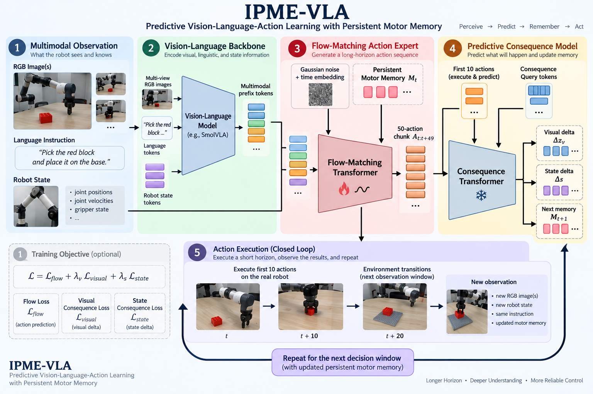

# IPME-VLA

**Predictive Vision-Language-Action Learning with Persistent Motor Memory**

IPME-VLA is a vision-language-action policy for chunked robot control. It augments a
flow-matching action expert with a predictive consequence model and a persistent motor
memory. The policy predicts a 50-action chunk, executes the first 10 actions, anticipates
the visual and robot-state changes caused by that initial horizon, and carries the resulting
memory tokens into the next decision window.



## Innovations

### Predictive consequence model

The consequence pathway conditions on the current multimodal prefix, persistent motor
memory, and the first action horizon. During training it receives the ground-truth first
10 actions. During inference it receives the first 10 actions generated by the flow-matching
expert. Learned consequence queries predict:

- the change in the pooled visual representation at the next observation window;
- the change in normalized robot state; and
- the hidden tokens used to update persistent motor memory.

The training objective is

```text
L = L_flow + lambda_visual L_visual + lambda_state L_state
```

Both consequence losses and their weights are configurable.

### Persistent motor memory

Four learned memory tokens initialize each episode. After every 10-action execution
window, normalized consequence tokens become the next motor-memory state. This state is
reused across successive decisions and can be cleared explicitly with `policy.reset()` at
an episode boundary.

## Architecture

```text
images + instruction -> vision-language backbone -> multimodal prefix
robot state --------------------------------------> state projection
noise + time + motor memory ----------------------> flow-matching action expert
                                                     |
                                                     v
                                              50-action chunk
                                                     |
                         first 10 actions + consequence queries
                                                     |
                                                     v
                                      predictive consequence model
                                      |             |             |
                                visual delta    state delta    next memory
```

The default configuration preserves the original IPME-VLA setup:

| Setting | Default |
| --- | ---: |
| Action chunk | 50 |
| Executed/predictive horizon | 10 |
| Flow denoising steps | 10 |
| Motor-memory tokens | 4 |
| Consequence-query tokens | 4 |
| Recurrent training windows | 4 |
| Visual consequence weight | 0.1 |
| State consequence weight | 0.1 |

## Installation

Python 3.10-3.12 is supported.

### pip

```bash
python3 -m venv .venv
source .venv/bin/activate
python3 -m pip install --upgrade pip
python3 -m pip install -r requirements.txt
python3 -m pip install -e . --no-deps
```

### Conda

```bash
conda env create -f environment.yml
conda activate ipme-vla
```

For CPU-only systems, install the appropriate PyTorch build first and then install this
package with `python3 -m pip install -e .`.

## Dataset Preparation

IPME-VLA reads local LeRobot v2.1 datasets directly, without an external LeRobot source
checkout. A dataset root must contain:

```text
dataset/
├── meta/
│   ├── info.json
│   ├── episodes.jsonl
│   ├── episodes_stats.jsonl      # recommended
│   └── tasks.jsonl
├── data/
│   └── ...
└── videos/
    └── ...                       # when visual features use video storage
```

`meta/info.json` must declare `observation.state`, `action`, visual features, `data_path`,
`video_path` when needed, frame rate, and chunk size. State/action dimensions and camera
keys are inferred from dataset metadata. The loader forms observation offsets
`[0, 10, 20, 30, 40]` and the action range `[0, 79]`, clamping episode boundaries and
providing padding masks.

Malformed metadata, missing parquet columns, incompatible versions, unresolved tasks, and
missing media produce explicit `DatasetFormatError` messages.

## Training

Edit [configs/ipme_vla_base.yaml](configs/ipme_vla_base.yaml) or override the common paths
and runtime values on the command line:

```bash
ipme-vla-train \
  --config configs/ipme_vla_base.yaml \
  --dataset /path/to/lerobot-v21-dataset \
  --output-dir outputs/ipme_vla \
  --device cuda
```

Equivalent source-checkout command:

```bash
python3 training/train.py \
  --config configs/ipme_vla_base.yaml \
  --dataset /path/to/lerobot-v21-dataset
```

The trainer computes normalization statistics from the selected training episodes, uses
AdamW with warmup/cosine decay, supports bfloat16 mixed precision, reports each loss term,
evaluates validation losses, and writes periodic versioned checkpoints.

## Resume Training

```bash
ipme-vla-train \
  --config configs/ipme_vla_base.yaml \
  --dataset /path/to/lerobot-v21-dataset \
  --resume outputs/ipme_vla/checkpoint_00002000.pt
```

Resume restores model, optimizer, scheduler, step, resolved model configuration, and
normalization statistics.

## Offline Evaluation

Evaluation reports recorded-dataset flow, visual consequence, state consequence, total
loss, visual/state delta mean absolute errors, and memory-norm metrics. It does not require
a simulator.

```bash
ipme-vla-evaluate \
  --checkpoint outputs/ipme_vla/checkpoint_final.pt \
  --dataset /path/to/lerobot-v21-dataset \
  --device cuda \
  --max-batches 100
```

## Inference

Generate a complete action chunk for a recorded observation:

```bash
ipme-vla-infer \
  --checkpoint outputs/ipme_vla/checkpoint_final.pt \
  --dataset /path/to/lerobot-v21-dataset \
  --sample-index 0 \
  --device cuda
```

For online control, call `select_action()` repeatedly and reset memory between episodes:

```python
policy.reset()
while not episode_done:
    action = policy.select_action(observation_batch)
```

See [examples/minimal_inference.py](examples/minimal_inference.py) for checkpoint loading
and action-chunk generation.

## Configuration

The base YAML has three sections:

- `model`: architecture, loss switches, dimensions, backbone, and token settings;
- `data`: local dataset path, episode selection, validation split, and video backend;
- `training`: optimizer, scheduler, batching, precision, logging, validation, and saving.

Dataset-derived `state_dim`, `action_dim`, and `image_features` replace machine- or
dataset-specific hard-coded mappings.

## Checkpoints

Checkpoint format version 1 contains:

- policy parameters;
- optimizer and scheduler state;
- training step and optional epoch;
- resolved `IPMEVLAConfig`;
- state/action normalization statistics;
- persistent motor-memory configuration; and
- optional user metadata.

The loader includes an internal key remapper for IPME-VLA checkpoints trained in the
original VLAb project. It does not convert checkpoints from other policies. Persistent
runtime memory is intentionally not serialized as episode state; call `reset()` at the
start of each new episode.

## Repository Layout

```text
IPME-VLA/
├── configs/
├── src/ipme_vla/
│   ├── models/
│   │   ├── vla/
│   │   ├── backbone/
│   │   ├── action_expert/
│   │   ├── consequence_model/
│   │   └── motor_memory/
│   ├── data/
│   ├── training/
│   ├── evaluation/
│   ├── inference/
│   └── utils/
├── training/
├── evaluation/
├── inference/
├── examples/
├── assets/
└── tests/
```

## Citation

Please cite the project when using IPME-VLA:

```bibtex
@software{mahua2026ipmevla,
  title  = {IPME-VLA: Predictive Vision-Language-Action Learning with Persistent Motor Memory},
  author = {Mahua},
  year   = {2026},
  url    = {https://github.com/THU-MAHUA/Predictive-Vision-Language-Action-Learning-with-Persistent-Motor-Memory}
}
```

## License

This repository is released under the Apache License 2.0. See [LICENSE](LICENSE) and
[NOTICE](NOTICE) for upstream attribution.

## Acknowledgments

The internal vision-language/action backbone support was adapted from work by the Hugging
Face robotics community. We thank the [SmolVLA project](https://huggingface.co/blog/smolvla)
for its open research and implementation foundations.
